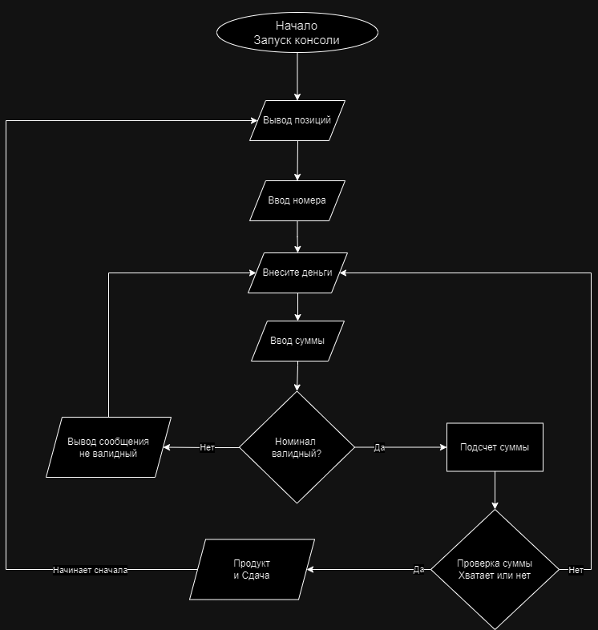

# Vending Machine
## Позиции

| №   | Продукт                | Цена  |
| --- | ---------------------- | ----- |
| 1   | Добрый Кола            | 100 р |
| 2   | Вода Черноголовка      | 80 р  |
| 3   | Сок Добрый             | 120 р |
| 4   | Чипсы Русская Картошка | 100 р |
| 5   | Печенье овсяное        | 60 р  |
## Алгоритм работы с точки зрения пользователя
1. Запуск программы (консольное приложение)
2. Автомат предлагает позиции для покупки списком
3. Пользователь выбирает одну из позиций путем ввода номера
4. Автомат просит внести сумму. При этом автомат может принимать купюры номиналом 50, 100, 500 рублей и монеты 5, 10
5. Пользователь вносит сумму. (Вводит число)
6. Автомат проверяет может ли он обработать такой номинал. Если не может то пишет сообщение что не может
7. После внесения автомат проверяет достаточно ли внесено денег. Если нет, то выводит сообщение об этом. Если да, то производит покупку.
8. Автомат выдает продукт и сдачу если нужно.
9. Всё начинает сначала (с пункта 2)

